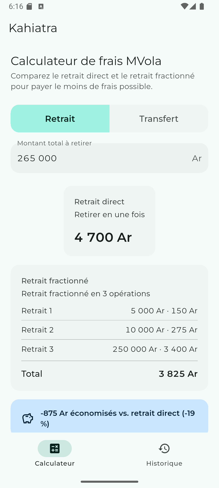
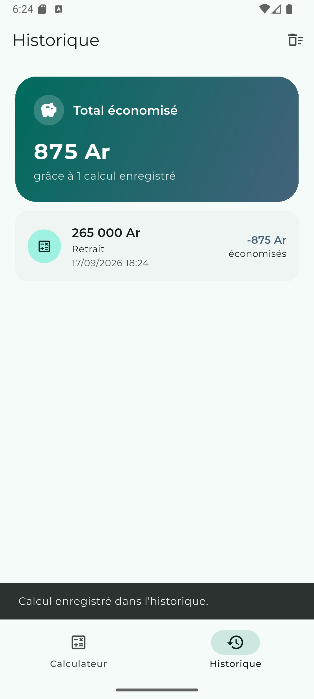

# Kahiatra

[](https://github.com/karozadev/KzMvolaMobile/releases/latest)
[](https://github.com/karozadev/KzMvolaMobile/actions/workflows/release.yml)
[](https://github.com/karozadev/KzMvolaMobile/releases)
[](LICENSE)

**Kahiatra** est un calculateur de frais MVola pour Madagascar : il compare le coût d'un retrait ou d'un transfert fait en une seule fois avec celui d'une décomposition optimisée en plusieurs opérations, et affiche l'économie réalisée. L'app est 100% locale : aucun compte, aucun serveur, aucune donnée envoyée nulle part.

Ce projet est le portage mobile Flutter de [KzMvola](https://github.com/karozadev/KzMvola), la version web d'origine.

<p align="center">
  <a href="https://github.com/karozadev/KzMvolaMobile/releases/latest">
    
  </a>
</p>

## Aperçu

<p align="center">
  
  
</p>

## Fonctionnalités

- Calcul du retrait ou du transfert le moins cher : comparaison entre une opération directe et une décomposition en plusieurs opérations, selon les grilles tarifaires officielles MVola (retrait, transfert vers un abonné MVola, vers un autre opérateur, ou vers un non-abonné).
- Historique local des calculs enregistrés, avec le total cumulé des économies réalisées.
- Partage natif d'un résultat (SMS, WhatsApp, etc.).
- Thème Material 3, clair et sombre, qui suit le thème du système.
- Aucune connexion internet requise, aucune donnée personnelle collectée.

## Installation

Téléchargez le dernier APK depuis la page [Releases](https://github.com/karozadev/KzMvolaMobile/releases/latest) et installez-le sur votre appareil Android (autoriser l'installation depuis une source inconnue si demandé).

## Développement

Prérequis : [Flutter](https://docs.flutter.dev/get-started/install) (canal stable).

```bash
git clone git@github.com:karozadev/KzMvolaMobile.git
cd KzMvolaMobile
flutter pub get
flutter run
```

### Tests et analyse statique

```bash
flutter analyze
flutter test
```

### Build d'un APK de release

```bash
flutter build apk --release
```

## Stack technique

- [Flutter](https://flutter.dev) / Dart, Material 3
- [`provider`](https://pub.dev/packages/provider) pour la gestion d'état
- [`shared_preferences`](https://pub.dev/packages/shared_preferences) pour l'historique local
- [`share_plus`](https://pub.dev/packages/share_plus) pour le partage natif

## Publication automatique

Chaque tag poussé au format `vX.Y.Z` déclenche le workflow [`.github/workflows/release.yml`](.github/workflows/release.yml) : build de l'APK de release, tests, puis publication automatique d'une [Release GitHub](https://github.com/karozadev/KzMvolaMobile/releases) avec l'APK en pièce jointe.

## Licence

Distribué sous licence [MIT](LICENSE).

## Auteur

Créé avec ❤️ par [Stephanot Zafindratafa](https://stephanot.karoza.dev).
